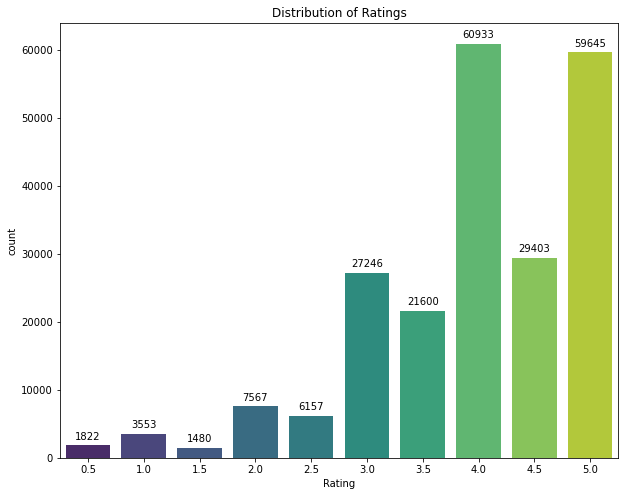
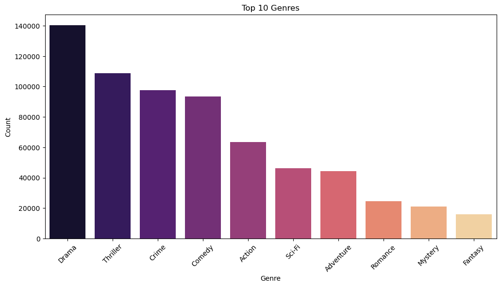
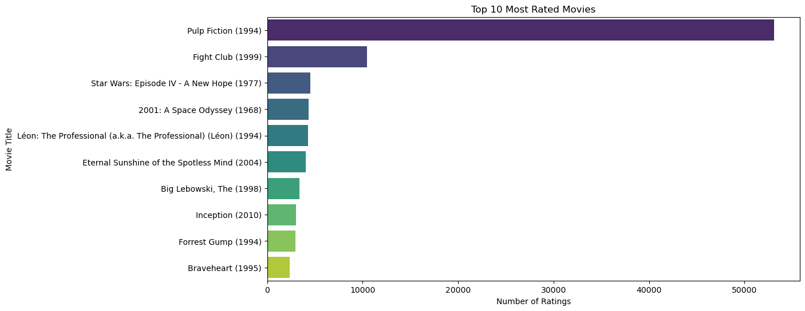

# Movie-recommendation-system

 

## Summary

**Business and data understanding:** The project aims to build a movie recommendation system using the MovieLens dataset, containing 230,000 rows of user ratings and movie metadata (genres, titles). This data is ideal for addressing the business need of personalized movie recommendations, leveraging both user behavior and movie characteristics.

**Data preparation** : For data preparation, the dataset was merged and reduced to 100,000 rows to enhance computational efficiency. Missing values were handled, and outliers removed to ensure data quality. Libraries like Pandas and NumPy were used for data processing.

**Modeling**: The modeling phase involved collaborative filtering using the Surprise library and content-based filtering via Scikit-learn. Collaborative models included KNNBasic, KNN with Means, KNN Baseline, and SVD, while the content-based model used vectorized movie genres and titles. SVD was selected for matrix factorization, and hyperparameters were tuned using grid search.

**Evaluation** : The final model, SVD, performed best with an RMSE of 0.2465 and an MAE of 0.191. Evaluation was done using 5-fold cross-validation to ensure model robustness, with average RMSE and MAE values calculated across different data subsets to minimize overfitting. This combination of collaborative filtering and content-based methods provides accurate, personalized recommendations for users.

## Project Overview
This project aims to enhance user experience on a streaming platform by developing a personalized movie recommendation system. Leveraging the [MovieLens dataset](https://grouplens.org/datasets/movielens/latest/), created by GroupLens.

By utilizing collaborative filtering techniques alongside a hybrid approach, this project seeks to provide tailored content recommendations that increase user engagement and retention. Our goal is to deliver relevant movie suggestions that cater to individual preferences, ultimately improving user satisfaction in a competitive streaming market.

## Business Understanding
In the context of a streaming service with a vast content library, user engagement is crucial for success. The company is experiencing lower-than-expected user interaction, characterized by reduced average watch times and higher churn rates. To combat this issue, the streaming platform recognizes the need for a sophisticated recommendation system that provides users with personalized movie suggestions based on their viewing history and rating patterns.

## Problem Statement
The streaming service faces a challenge in maintaining user satisfaction and engagement levels. Many users are not interacting with the platform as anticipated, leading to decreased watch times and an increase in user churn. The primary objective is to develop a recommendation system capable of delivering personalized movie recommendations that align with users’ preferences, thereby improving engagement and retention.

## Objectives
1. **Build a Recommendation System**: Develop a system that generates the top 5 movie recommendations for each user based on their previous ratings. The model will employ collaborative filtering techniques, supplemented by a hybrid approach to effectively tackle the cold-start problem for new users.

2. **Increase User Engagement**: Provide personalized recommendations that cater to individual tastes, encouraging users to explore additional content on the platform and ultimately leading to longer average watch times.

3. **Improve Retention**: By consistently delivering relevant recommendations, the system will work to reduce user churn, fostering loyalty to the platform over time.

4. **Personalize Content Discovery**: Allow users to discover content that aligns with their unique preferences, enhancing their connection to the platform and its offerings.

5. **Mitigate Cold-Start Problem**: Implement a hybrid recommendation strategy that combines collaborative filtering with content-based filtering to offer relevant suggestions to new users who have minimal interaction history.

## Data Understanding
The project will utilize the [MovieLens dataset](https://grouplens.org/datasets/movielens/latest/) from the GroupLens research lab at the University of Minnesota. The smaller dataset, containing 100,000 ratings and metadata for 9,000 movies rated by 600 users, includes the following files:

- **Links.csv**: Contains unique identifiers for movies, including movie IDs, TMDB IDs, and IMDB IDs.

- **Movies.csv**: Contains metadata about the movies, including titles and genres.

- **Ratings.csv**: Comprises user ratings for various movies, facilitating the collaborative filtering process.

- **Tags.csv**: Contains tags applied to movies by users, providing additional context for content-based filtering.

## Exploratory Data Analysis

### Univariate Analysis
#### 1.Distribution of Ratings.

**4.0** and **5.0** are the most frequent ratings with ratings count of 60933 and 59645 respectively.

#### 2.Distribution of Top 10 Genres

**Drama**, **Thriller** and **Crime** are the top 3 movie Genres wihle Fantasy has the lowest count.

### Bivariate Analysis

#### 3. Distribution of Top 10 Most Rated Movies.

**Pulp Fiction(1994)** is the most rated movie with the higest rate count of above 50000.

#### 4.Top 20 Highest Rated Movies.

There are 10 movies with the **5.0** rating.

#### 5. Distribution of Average Rating per Genre.

**Crime | War | Thriller | Drama | Film-Noir** - are the top rated genres, with an average of **4.0+**  

## Modeling
The goal was to reduce the RMSE and MAE of the models to get the best fit model.

| **Model**                      | **Metric** | **Value** |
|---------------------------------|------------|-----------|
| **KNNBasic (COSINE Similarity)** | RMSE       | 0.8242    |
|                                 | MAE        | 0.5923    |
| **KNNBasic (PEARSON Similarity)**| RMSE       | 0.7246    |
|                                 | MAE        | 0.5155    |
| **KNN with Means**              | RMSE       | 0.6955    |
|                                 | MAE        | 0.4914    |
| **KNN Baseline (PEARSON Similarity)** | RMSE       | 0.6147    |
|                                 | MAE        | 0.4171    |
| **SVD (Matrix Factorization)**   | RMSE       | 0.5081    |
|                                 | MAE        | 0.3467    |
| **SVD (with GridSearchCV)**      | RMSE       | 0.2465    |

### Final Model

| **Model**                      | **Metric** | **Value** |
|---------------------------------|------------|-----------|
| **SVD (with GridSearchCV)**      | RMSE       | 0.2465    |

- The SVD model with tuned parameters provided the best performance, with the lowest RMSE metrics.

## Conclusion
- KNNBasic (COSINE and PEARSON Similarity): The baseline models (KNNBasic) demonstrate moderate performance, with the PEARSON similarity yielding slightly better results compared to COSINE similarity.

- KNN with Means: Incorporating the mean of users' ratings into the KNN model improved performance, reducing both RMSE and MAE. This suggests that adjusting for users' average ratings adds value to the prediction accuracy.
- KNN Baseline: This model performed the best among neighborhood-based models, with a significant drop in both RMSE and MAE. Using the baseline approach with PEARSON similarity led to a solid improvement.
- SVD (Singular Value Decomposition): The matrix factorization model (SVD) offered the best improvement over the neighborhood-based models, with a much lower RMSE and MAE, indicating a more accurate prediction of user ratings.
- SVD with GridSearchCV: The best-performing model is the SVD with hyperparameter tuning via GridSearchCV. This approach reduced RMSE to 0.2465, indicating a highly accurate model.

## Recommendations
- Adopt SVD as the Primary Model: The SVD model has demonstrated superior performance and lower prediction errors, making it the best choice for providing accurate movie recommendations.

- Incorporate a Hybrid Model: Combine SVD with Content-Based Filtering to handle new users who have not provided ratings. This will improve personalization for all users, including cold-start scenarios.

- Enhance User Feedback: Encourage users to provide feedback on the recommendations to continuously refine the model’s predictions and adapt to their evolving preferences.

- Regular Updates: The model should be retrained regularly with new data to ensure it remains up-to-date with user tastes and movie trends. This will maintain the system’s relevance and accuracy over time.

- Diversity in Recommendations: Consider implementing a diversity factor to avoid repetitive suggestions, ensuring users are exposed to a broader range of movies.

